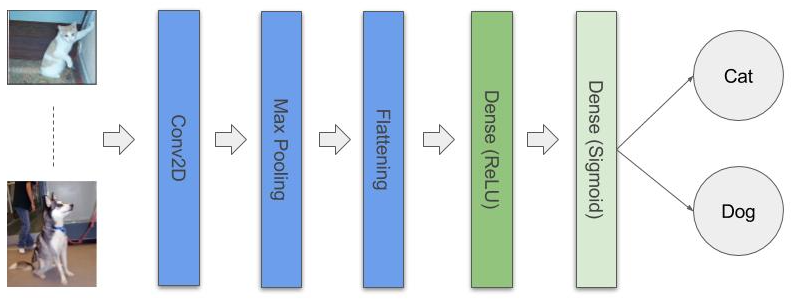

## Using CNNs to classify images

### Prereqs

1. Make sure to have <a href="https://www.tensorflow.org/install/">Tensorflow</a> and <a href="https://keras.io/">Keras</a> installed.

2. Download the train.zip <a href="https://www.kaggle.com/c/dogs-vs-cats/data">from here</a> (requires registration on Kaggle).

3. Create the following folder structure as shown below:
<br>`../dataset/train/cats
../dataset/train/dogs
../dataset/validate/cats
../dataset/validate/dogs`

4. Extract the train.zip and move 4K cats into the `train/cats` and 1K cats into the `validate/cats`. Do the same with the dogs. You should end up with 4K training images and 1K test images for each class respectively*. 

<div class="alert alert-block alert-info">
\* _If you have enough patience, time and computing power you can use the full set, just make sure to use 80% of the images for training and 20% for testing_
</div>

### Architecture



1. __Sequential__ - in Kears is basically a _list_ that holds the layers of our architecture.
2. __Conv2D__ - 2D convolution layer (e.g. spatial convolution over images). This layer creates a convolution kernel that is convolved with the layer input to produce a tensor of outputs. 
3. __Max Pooling__ - After having the feature maps we need to further discretize our image to prepare for flattening.
4. __Flattening__ - this is where we turn the max pool matrixes into 1D vecotrs in order to pass down to the hidden NN layer(s).
5. __Dense (ReLU)__ - Hiddel NN layer with using rectifier activation.
6. __Dense (Sigmoid)__ - Last NN layer (a.k.a output layer) with Sigmoid activator.


```python
# The imports
from keras.models import Sequential
from keras.layers import Conv2D, MaxPool2D
from keras.layers import Flatten
from keras.layers import Dense
from keras.preprocessing.image import ImageDataGenerator
```


```python
# Step1.  
classifier = Sequential()
```


```python
# Step 2 - Convolution Layer 
classifier.add(Conv2D(32, (3, 3), input_shape=(64, 64, 3), activation='relu'))
```

Conv2D(32, (3, 3), input_shape=(64, 64, 3), activation='relu'))
1. It is a common practice to start with 32 feature detecors.
2. 3 x 3 - dimensions of the feature detector
3. We need to convert all input images to have the same size (64, 64) and since we are working with color images than we need 3 channels. 
4. Rectifier activation function. (_The rectifier activator is used here to remove the negative pixel values from our feature maps. Not to confuse with the purpose of an activator in a neuron_). 


```python
# Step 3 - Max Pooling
classifier.add(MaxPool2D(pool_size = (2, 2)))
```


```python
# Step 4 - Flattening
classifier.add(Flatten())
```


```python
# Step 5 - The Neuron Layer
classifier.add(Dense(units = 128, activation="relu"))
```

__Estimating the amount of units (neurons)__<br>
As a general rule it is recommended to use a number between the amount of the inputs and the amount of the outputs. In our case, though, the amount of inputs is quite large (even after convoluting and max puuling) and the amount of output is just 2, so I just picked an average of whatever the numbers I saw in Keras samples :) (_It seems though as the numbers are in power of 2_). 

At some point I will try with 256 and see what happens. Higher number should lead to a greater accuracy, however it is more computationally intensive. 

<div class="alert alert-block alert-info">
For detailed explanation of the dim, shape and unit parameters see this SO: https://stackoverflow.com/questions/44747343/keras-input-explanation-input-shape-units-batch-size-dim-etc
</div>


```python
# Step 6 - Now let's add the output layer with the sigmoid function. 
# Note that for a binary classifier one unit is enough.
classifier.add(Dense(activation="sigmoid", units = 1))
```


```python
# Step 7 - Compiling the whole thing using the stochastic gradient decent algorithm
classifier.compile(optimizer = 'adam', loss = 'binary_crossentropy', metrics = ['accuracy'])
```

<a href="https://machinelearningmastery.com/adam-optimization-algorithm-for-deep-learning/">Great intro to Adaptive Moment Estimation optimizer (a.k.a ADAM)</a>


```python
# Step 8 - Fitting (a.k.a training) 
# copied from Keras docs
train_datagen = ImageDataGenerator(
        rescale=1./255,
        shear_range=0.2,
        zoom_range=0.2,
        horizontal_flip=True)

test_datagen = ImageDataGenerator(rescale=1./255)

training_set = train_datagen.flow_from_directory('dataset/training_set',
                                                 target_size=(64, 64),
                                                 batch_size=32,
                                                 class_mode='binary')

test_set = test_datagen.flow_from_directory('dataset/test_set',
                                            target_size=(64, 64),
                                            batch_size=32,
                                            class_mode='binary')

classifier.fit_generator(training_set,
                        steps_per_epoch=4000, # since we have 8000 images
                        epochs=25,
                        validation_data=test_set,
                        validation_steps=1000) # number of images in the test set
```

### Saving the weights

If you got this far with a decent accuracy (say 80% and higher) then save the model to use it later on.


```python
classifier.save('cats_and_dogs_model.h5')
```

To load the weights and try them on your own pet images 


```python
import numpy as np
from keras.preprocessingsing import image

my_pet_image = image.load_img('path to your image')
my_pet_image = image.img_to_array(my_pet_image)
my_pet_image.expand_dims(test_image, axis = 0)
result = classifier.predict(my_pet_image)

# double check class indicies 
training_set.class_indices

# correct the index for the 'dog' if necessary
if result[0][0] == 1:
    prediction = 'dog'
else:
    prediction = 'cat'
    
prediction
```
