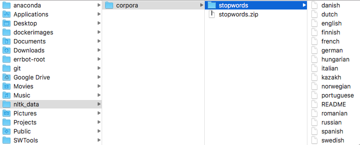

## Simple sentiment analysis of restaurant reviews using Gaussian Naive Bayes

The included dataset is a tab delimited file containing reviews with corresponding lables (i.e. like/dislike)

<table style="float:left">
    <th>Review</th><th>Like</th>
    <tr><td>Wow ... loved this place.</td><td>1</td></tr>
    <tr><td>Crust is not good.</td><td>0</td></tr>
    <tr><td colspan=2>...</td></tr>
</table>

### Step 1 - Import the dataset
(_pandas is a Python package providing fast, flexible, and expressive data structures designed to make working with “relational” or “labeled” data both easy and intuitive._)


```python
import pandas as pd
# quoting=3 means to disregard the quotes
dataset = pd.read_csv('Restaurant_Reviews.tsv', delimiter = '\t', quoting = 3) 
```

at this point the _dataset_ is a DataFrame with 2 columns and 1000 records.


```python
# make sure the data got imported properly. If all is good, you should see the output from the dataset.
dataset
```

### Step2 (Optional)
If you want to test the model on your own reviews, add them to the [Restaurant_Reviews_TT.tsv], then import and concatenate with the original dataset. 


```python
# add my own dataset
dataset_mine = pd.read_csv('Restaurant_Reviews_TT.tsv', delimiter = '\t', quoting = 3)
dataset = pd.concat([dataset, dataset_mine], ignore_index = True)
```

### Step 3 - Data Preparation
Before our dataset can be used for training, it has to be cleaned up. I.e. we need to:
- Cleanup the numbers
- Cleanup the punctuation 
- Remove the articles (a/an and the)
- Leave only the words that are relevant. For example from the first revew  _"Wow ... we loved this place."_ only the word **loved** is relevant.
- Apply stemming\* - i.e. ***loved*** and/or ***loving*** is the same as ***love*** so we only need one

<font color="gray">\* <a href="http://www.nltk.org/howto/stem.html">_Stemmers</a> remove morphological affixes from words, leaving only the word stem._</font>

##### Import the stemmer from Natural Language Toolkit 
_(Note, you only need to do this once)_


```python
# you need to do this only once
import nltk
nltk.download('stopwords')
```

After the import you should end up with a folder somewhere on your file system as in the pic below.



Let's run the cleanup now and append the cleaned reviews to a list called 'corpus' _(in Natural Language Processing the word corpus is used a lot meaning 'a body of text')_.

import re
from nltk.corpus import stopwords
from nltk.stem.porter import PorterStemmer
ps = PorterStemmer()
corpus = []
for i in range(0, 1000):
    review = re.sub('[^a-zA-Z]', ' ', dataset['Review'][i]) # replace with space anything that's not a character
    review = review.lower() # lowercase
    review = review.split() # turn sentences into array of words
    review = [ps.stem(word) for word in review if not word in set(stopwords.words('english'))]
    review = ' '.join(review)
    corpus.append(review)


```python
# optionally run this cell to see how the cleaned up reviews look
corpus
```

### Step 4 - Creating the Bag of Words model (i.e. a sparse matrix)
In this step we will create a, so called, Bag of Words model - a way of representing text data when modelling text with machine learning algorithms. 

In essense, we are creating a table where each column is going to represent a unique word from our dataset and each row representing a single review. Then, for each cell we will have 1 if that word appears in the review and 0 otherwise. As a result, we will end up with a _wide_ table (i.e. 1K+ columns) where most of the cells are going to be filled with zeroes, hence the term _sparse matrix_.


```python
from sklearn.feature_extraction.text import CountVectorizer

count_vectorizer = CountVectorizer(max_features = 1500)
X = count_vectorizer.fit_transform(corpus).toarray()
y = dataset.iloc[:, 1].values
```

at this stage, **X** contains our sparse matrix while the **y** is essentially our second column from the datase (1s for likes and 0s for dislikes).


```python
# Optionally run this to see what's inside the var X 
X
```

### Step 5 (mandatory only if you ran the optional Step 2, otherwise skip to the next step)

_If you added your own reviews to the original dataset, make sure to remove them before the training. After running this step you will end up with the following variables:_
- X_tt - custom reviews
- y_tt - custom lables (i.e. your own rating)
- X - original reviews
- y - original labels


```python
X_tt = X[1000 : 1002, :] # take the reviews from 1000 till 1002 (assuming you added 2 reviews to the original dataset)
y_tt = y[1000:1002] # take the labels from 1000 till 1002 (assuming you added 2 reviews to the original dataset)
X = X[0 : 1000, :] # take the original 1000 reviews only
y = y[0:1000] # take the original 1000 labels only
```

### Step 6 - Split the dataset into training and test sets
We are using a 80/20 split. I.e. using 80% of the data for training and 20% for testing


```python
from sklearn.model_selection import train_test_split
X_train, X_test, y_train, y_test = train_test_split(X, y, test_size = 0.20, random_state = 0)
```

At this step we ended up with the following four variables
- X_train - 80% of the original reviews that will be used for training
- y_train - Corresponding labels (classes) of the reviews from X_train
- X_test - 20% of the original reviews that will be used to assess the accuracy of the model
- y_test - Corresponding labels (classes) of the reviews from X_test

### Step 7 - Training !!!
Generally speaking, training (a.k.a fitting) in Machine Learing means finding patterns in data. In our case the GaussianNB model is going to use the training data to _learn_ the combinations of words matching to likes or dislikes.


```python
from sklearn.naive_bayes import GaussianNB
classifier = GaussianNB()
classifier.fit(X_train, y_train)
```


    GaussianNB(priors=None)


### Step 8 Perdicting the test set
Now that our model has been trained, let's use the remaining 20% of the reviews (i.e. the X_test) to predict the labels (raitings). We will then use these predictions to compare against the real raitings from the y_test.


```python
# y_pred_tt = classifier.predict(X_tt) # uncomment this line to run the predictions on your custom reviews
y_pred = classifier.predict(X_test)
```

### Step 9 Assessing the accuracy of the model
We have
- y_pred - predictions
- y_test - real data

The way we assess the accuracy of our model is by creating a, so called, **Confusion Matrix**. In this case our CM is going to be a 2x2 table reflecting the numbers for the correct and incorrect predictions.


```python
from sklearn.metrics import confusion_matrix
cm = confusion_matrix(y_test, y_pred)
# cm_tt = confusion_matrix(y_tt, y_pred_tt) # uncomment to create a CM on your custom reviews
```


```python
# run this to rpintout the content of the cm variable (or cm_tt)
cm
# cm_tt
```


    array([[55, 42],
           [12, 91]])


### Interpreting the Results:
Assuming you used the same random seed in Step 6 (random_state = 0) your CM should look like follows:
<table style="float:left">
    <th>&nbsp;</th><th>Likes</th><th>Dislikes</th>
    <tr><td>Predicted Likes</td><td>**55**</td><td>42</td></tr>
    <tr><td>Predicted Dislikes</td><td>12</td><td>**91**</td></tr>
</table>

The number 55 shows the amount of positive predictions (i.e. likes from y_pred) which matched the likes from the testing set (i.e. y_test). Likewise, the number 91 shows the amount of correctly predicted dislikes. You can guess what the numbers 12 and 42 indicate now.

And so, our model made 146 correct predictions out of total 200 thus achiving the accuracy of 73%.


```python
(55 + 91)/(55 + 91 + 12 + 42)
```


    0.73


```python

```
